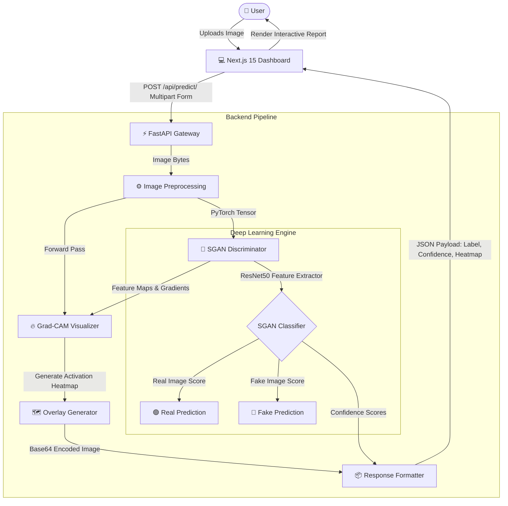

# 🛡️ DeepVault: Advanced Deepfake Image Detection System

[](https://www.python.org/)
[](https://pytorch.org/)
[](https://fastapi.tiangolo.com/)
[](https://nextjs.org/)
[](https://www.typescriptlang.org/)
[](https://tailwindcss.com/)
[](https://www.docker.com/)

DeepVault is a state-of-the-art, production-ready, full-stack AI platform designed to detect deepfake images and media manipulations with high reliability and visual explainability. The core architecture leverages a **Semi-Supervised Generative Adversarial Network (SGAN)** built upon a **ResNet50 backbone** in PyTorch, coupled with a high-performance **FastAPI** backend and an elegant, responsive **Next.js** dashboard featuring **Grad-CAM** visual heatmaps.

---

## 📐 System Architecture

Below is the workflow of the DeepVault system showing the high-level request-response lifecycle, machine learning model evaluation, and Grad-CAM explainability generation.



---

## 🚀 Key Features

* **SGAN Binary Classifier**: Deep learning model that utilizes a Semi-Supervised GAN structure where the discriminator categorizes inputs as **Real**, **Fake (Generated)**, or **Unlabeled (Auxiliary Semi-Supervised Loss)**, yielding superior accuracy compared to standard supervised networks.
* **ResNet50 Backbone**: Powering the feature extraction layer to extract low, medium, and high-level visual patterns (color gradients, frequency anomalies, facial boundary blending).
* **Grad-CAM Explainability**: Visualizes the exact pixel regions of interest where the discriminator detected inconsistencies or GAN artifacts (e.g. eye alignment, ear shapes, boundary smudging).
* **Sleek Premium Dashboard**: Premium glassmorphism UI built with **React**, **Next.js**, and **Tailwind CSS** featuring smooth micro-animations, real-time drag-and-drop file upload, and detailed reports.
* **Fully Dockerized & Production Ready**: Packaged for robust local development or cloud deployment (Render, AWS, GCP, Vercel, Railway).

---

## 📂 Project Directory Structure

```directory
pbl/
├── backend/                  # FastAPI Application Layer
│   ├── api/                  # API Routers & Endpoints
│   │   └── predict.py        # Prediction, Classification, and Grad-CAM generation API
│   ├── __init__.py
│   └── main.py               # Main API application entrypoint & CORS middleware
├── checkpoints/              # Directory containing trained model weight checkpoints (.pth)
├── datasets/                 # Dataset Loader & Dataset Preprocessing Pipeline
│   ├── dataset.py            # Custom PyTorch Dataset class
│   └── __init__.py
├── frontend/                 # Next.js Web Dashboard
│   ├── src/
│   │   ├── app/              # Next.js Pages & Layouts (globals.css, layout.tsx, page.tsx)
│   │   └── components/       # Custom React Components
│   │       └── ui/           # Premium UI Elements (file-upload.tsx)
│   ├── package.json          # Node dependencies and scripts
│   └── tsconfig.json         # TypeScript configuration
├── models/                   # Neural Network Architecture Definition
│   ├── resnet_backbone.py    # ResNet50 Feature Extractor Setup
│   ├── sgan.py               # Semi-Supervised GAN Model definition
│   ├── grad_cam.py           # Grad-CAM explanation extractor class
│   └── __init__.py
├── training/                 # Deep Learning Training Pipelines
│   ├── train_sgan.py         # SGAN model training & evaluation script
│   └── __init__.py
├── utils/                    # Shared Helper Functions
│   ├── image_processing.py   # Tensor conversions, overlay blending, & Base64 encodings
│   └── __init__.py
├── Dockerfile                # Multi-stage production container setup for FastAPI backend
├── requirements.txt          # Python packages and ML dependencies
└── .gitignore                # Global project Git exclusions
```

---

## ⚙️ Quick Start & Local Setup

### Prerequisites
* **Python 3.11+** installed locally.
* **Node.js 18+** & **npm** installed locally.
* **Git** CLI.

---

### Step 1: Environment Variables
Copy the example environment configuration into `.env` at the project root:
```bash
cp .env.example .env
```

---

### Step 2: Backend Setup (FastAPI)
It is recommended to run the ML backend in a Python virtual environment:

```bash
# 1. Create a virtual environment
python -m venv venv

# 2. Activate the virtual environment
# On macOS/Linux:
source venv/bin/activate
# On Windows (PowerShell):
# .\venv\Scripts\Activate.ps1

# 3. Install Python dependencies
pip install -r requirements.txt

# 4. Start the FastAPI development server
uvicorn backend.main:app --host 0.0.0.0 --port 8000 --reload
```
* **API Documentation**: The interactive swagger UI is automatically served at `http://localhost:8000/docs` or `http://localhost:8000/redoc`.

---

### Step 3: Frontend Setup (Next.js 15)
In a separate terminal window, set up and launch the web interface:

```bash
# 1. Change directories to the frontend workspace
cd frontend

# 2. Install Node modules
npm install

# 3. Spin up the Next.js development server
npm run dev
```
* **Web Dashboard URL**: The app will be available at `http://localhost:3000`.

---

### Step 4: Run via Docker (Alternative Backend Launch)
To containerize and launch the FastAPI ML service in a standard runtime container:

```bash
# 1. Build the Docker container image
docker build -t deepfake-api .

# 2. Run the Docker container exposing port 8000
docker run -p 8000:8000 deepfake-api
```

---

## 🧠 SGAN Architecture & Training Model

The **Semi-Supervised GAN (SGAN)** discriminator performs multi-class classification:
1. **Class 0**: Real Images (from real training subset).
2. **Class 1**: Fake/Generated Images (created by generator or external deepfakes).
3. **Class 2**: Unlabeled/Fake generated class used for adversarial training.

### How to Train the Model
1. Organise your custom training and validation dataset inside `datasets/data/` structured in standard classification format:
   ```directory
   datasets/data/
   ├── train/
   │   ├── real/
   │   └── fake/
   └── val/
       ├── real/
       └── fake/
   ```
2. Trigger the training pipeline:
   ```bash
   python -m training.train_sgan --data_dir ./datasets/data --epochs 50 --batch_size 32 --lr 0.0002
   ```
3. Saved weights are automatically exported into the `checkpoints/` directory.

---

## 🔥 Explainability via Grad-CAM

DeepVault incorporates **Gradient-weighted Class Activation Mapping (Grad-CAM)** to address the "black-box" issue of traditional neural networks.

1. During the forward pass, the model extracts the activation maps of the **last convolutional layer of the ResNet50 backbone** (e.g. `layer4` of ResNet50).
2. During the backward pass, gradients of the predicted class score (Real or Fake) are computed with respect to these feature maps.
3. The gradients act as weights representing the importance of each feature map channel for the target class.
4. A weighted combination is passed through a **ReLU** activation to output a 2D activation heatmap indicating exactly where the deepfake artifacts reside.
5. The heatmap is normalized, colored, and overlaid onto the original image before being returned in a base64 encoded format for instant display in the Next.js React UI.

---

## 🌐 Deployment Details

* **Frontend**: Optimized for instant deployment on **Vercel** with full NextJS static compilation and edge API routes.
* **Backend**: Packaged with a production-grade multi-stage `Dockerfile`, perfect for automated cloud-provider platforms like **Render**, **Railway**, **AWS ECS**, or **Google Cloud Run**.

---

## 📄 License
This project is licensed under the MIT License. See individual files for details.
